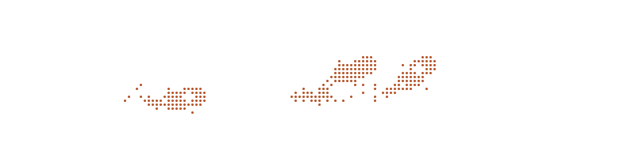

# it's rv.

cs @ concordia · montréal

i like building random little tools and nerding out over whatever i'm into at the moment. music, photos, keyboards, and whatever rabbit hole comes next.

[website](https://rvdeguzman.com) · [linkedin](https://linkedin.com/in/rvdeguzman)

<a href="https://rvdeguzman.com">
  <picture>
    <source media="(prefers-color-scheme: dark)" srcset="koi-dark.svg">
    <source media="(prefers-color-scheme: light)" srcset="koi-light.svg">
    
  </picture>
</a>

### a few things i've made

- [fons](https://github.com/rvdeguzman/fons) — a terminal markdown reader with link navigation and inline mermaid diagrams
- [concordia webring](https://github.com/rvdeguzman/concordia-webring) — connecting personal sites from concordia students and alumni
- [ray²caster](https://github.com/rvdeguzman/raycaster) — a raycaster in c with raylib

<!-- To regenerate the pond SVGs: make koi (requires Node 22.6+ and ../braille-koi). -->
